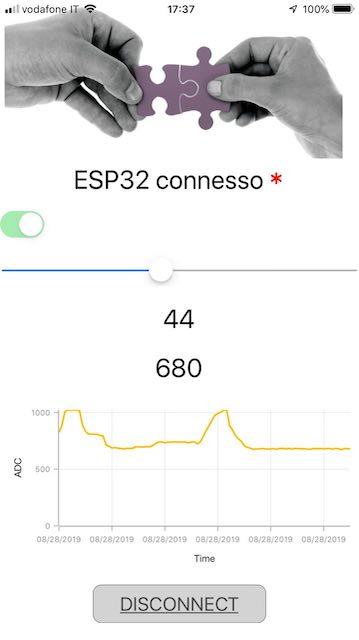

# ESP32BLE
Esempio di utiliizo di BLE con ESP32 e client Xamarin.Forms

## Requisiti:
- Visual Studio 2019 community edition.
- Visual Studio Code con PlatformIO. 
- Collaudato su Scheda WeMos D1 R32 e IPhone 6

## Dipendenze:
### Lato Mobile: 
- Libreria BLE.Net per Xamarin.Forms https://github.com/nexussays/ble.net.git
- Libreria Material https://docs.microsoft.com/en-us/xamarin/xamarin-forms/user-interface/visual/material-visual

### Lato ESP32: 
- Libreria BLE di Neil Kolban https://github.com/nkolban/ESP32_BLE_Arduino
